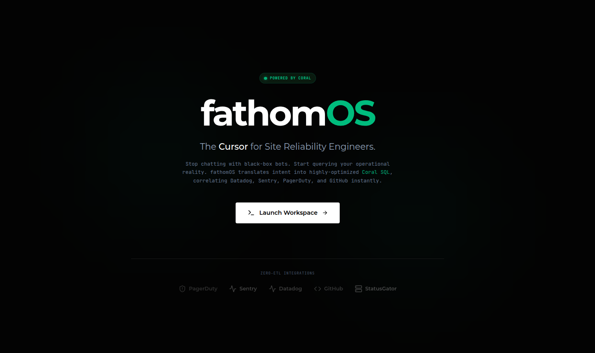
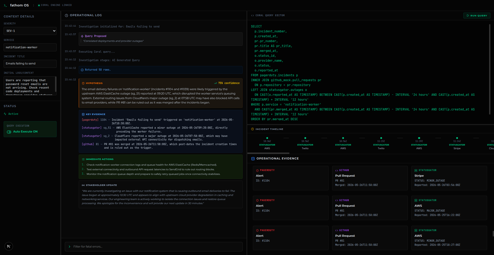

# fathomOS: Operational IDE for SREs



fathomOS is an AI-assisted operational IDE ("Cursor for SREs") that uses Coral to query multiple data sources. 

It fundamentally re-architects incident response by replacing scattered dashboard investigations with a unified, iterative SQL workspace. 

Instead of writing glue code to connect Datadog, PagerDuty, GitHub, and Sentry, fathomOS uses **Coral SQL** to join massive, multi-source datasets entirely locally in milliseconds. The AI acts as an assistant—translating operational context into cross-source Coral SQL—while the engineer retains full execution control.

## Our Product



* **Evidence First:** Replaces generic AI chatbot markdown with structured Operational Evidence Cards (PagerDuty, Sentry, GitHub, Datadog, StatusGator).
* **Iterative Investigation:** A persistent timeline log tracks query evolution. Say "filter for fatal errors" and watch the AI dynamically refine the Coral SQL query.
* **Auto/Manual Execution:** Toggle between safe manual review of AI-generated queries, or blazing-fast auto-execution for lightning incident response. 

## Architecture & API

fathomOS is composed of a Next.js frontend and a FastAPI backend, powered by Gemini 3.5 Flash.

### Core API Endpoints
1. `POST /api/generate-sql`: 
   - **Logic:** Injects the Coral SQL schema into the LLM context to generate a dynamic, cross-source Coral SQL query based on operator intent.
   - **Self-Healing Loop:** Silently tests the generated SQL against the Coral CLI. If Coral throws a syntax error, the backend catches the traceback, feeds it back to the LLM, and self-heals the query before returning it to the client.

2. `POST /api/execute-investigation`:
   - **Logic:** Executes the generated SQL via the Coral CLI. It returns the raw database rows to the frontend for visual rendering (Evidence Cards), and then passes those rows to the LLM to generate a structured Root Cause Analysis (Hypothesis, Confidence, Actions).

### Coral SQL Usage
Coral is the execution engine. Rather than building custom API integrations for 5 different services, fathomOS relies entirely on Coral's unified SQL layer. 
- **The LLM writes the SQL:** e.g., `SELECT * FROM pagerduty.incidents INNER JOIN datadog.metrics...`
- **The Backend executes it:** `coral sql "<query>" --format json`
- **Data abstraction:** We use Coral's `jsonl` provider to query our high-fidelity synthetic telemetry as if it were a live cloud database.

## Running the Project Locally

**Prerequisites:** You must have the [Coral CLI](https://github.com/Yext/coral) installed on your machine.

### 1. Start the Backend (FastAPI + Coral + Gemini)
The Python environment uses `venv` (not `.venv`). 

```bash
# In the root of the fathomOS repository:
source venv/bin/activate

# Navigate to backend and start the server
cd backend
uvicorn main:app --reload
```
*(Note: Ensure you have your `GEMINI_API_KEY` set in `backend/.env`)*

### 2. Start the Frontend (Next.js)
```bash
# In a new terminal window from the root:
cd frontend
npm install
npm run dev
```

### 3. Test the Workflow
1. Open `http://localhost:3000`.
2. Enter the incident title: **"API latency spike in us-east-1"** and hit Launch Investigation.
3. fathomOS will generate a cross-source JOIN query across the 5 mock datasets (1000+ rows). 
4. Click **Run Query** to instantly reveal the precise Datadog latency spike, the fatal Sentry error, the PagerDuty alert, and the GitHub PR that caused it all.
5. Turn on **Auto Execute** in the left sidebar and type a follow-up command like *"Only show me the Sentry errors"* to see the timeline evolve instantly.
